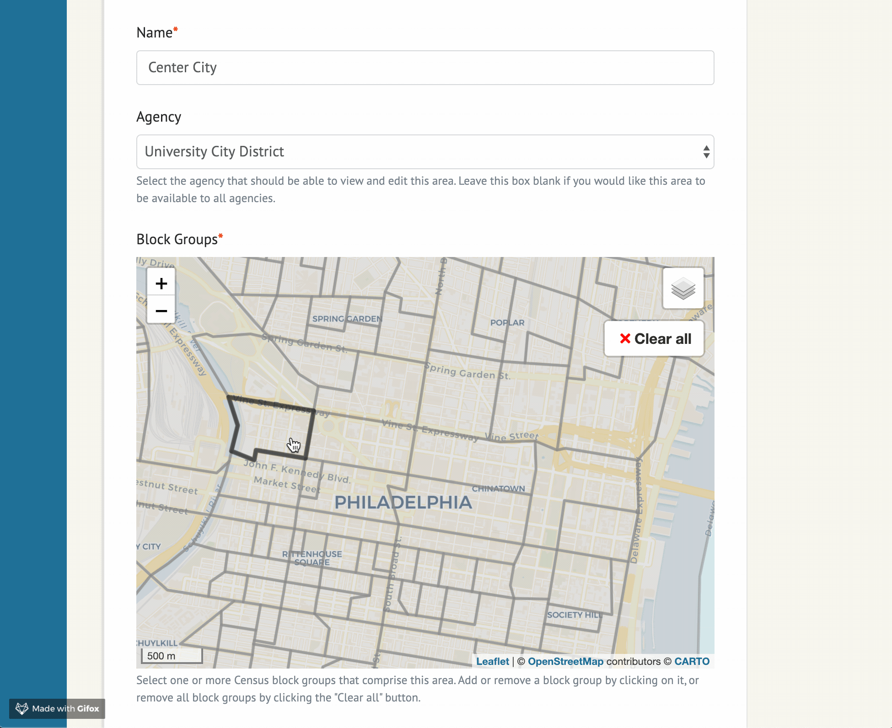
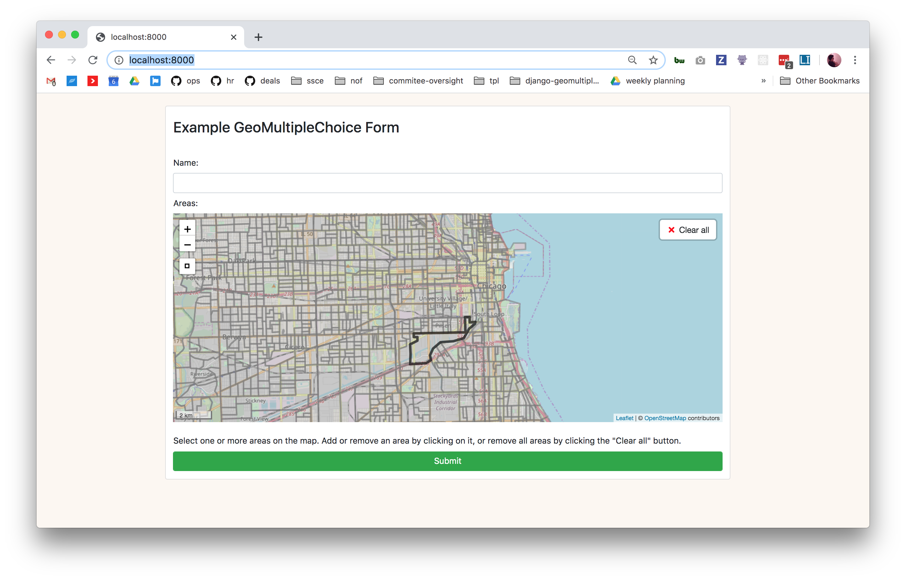

# 🗺 GeoMultipleChoice

A Django widget to select multiple geographic areas.



Originally created by [@jeancochrane](https://github.com/jeancochrane). Packaged up by [@beamalsky](https://github.com/beamalsky).

## Installation

TK

## Widget options

The `example` project in this repo contains the following sample form implementation:

```python
class ExampleGeoMultipleChoiceForm(forms.ModelForm):
    class Meta:
        model = SelectedArea
        fields = '__all__'

    def __init__(self, *args, **kwargs):
        super().__init__(*args, **kwargs)

        settings_overrides = {
            'DEFAULT_ZOOM': 12,
            'DEFAULT_CENTER': (41.88, -87.7),
            'RESET_VIEW' : True, # Defaults to True
            # Sets the bounds of RESET VIEW; y min, x min, y max, x max
            # See https://github.com/makinacorpus/django-leaflet/issues/192
            'SPATIAL_EXTENT': (-87.3, 41.5, -88, 42.15),
            'MAP_ID': 'my-example-map', # Defaults to 'map'
            'MAP_HEIGHT': '400px',
            'MAP_WIDTH': '100%',
            'MAP_LAYER_STYLE': {
              'color': '#7a7a7a',
              'weight': 3,
              'opacity': 0.5,
              'fillColor': '#999999',
              'fillOpacity': 0.3,
            },
            'MAP_LAYER_SELECTED_STYLE': {
              'color': '#7a7a7a',
              'weight': 3,
              'opacity': 0.5,
              'fillColor': 'black',
              'fillOpacity': 0.7
            }
        }

        self.fields['areas'].widget = GeoMultipleChoiceWidget(
            choices=[
                (choice.id, choice) for choice
                in Area.objects.all()
            ],
            settings_overrides=settings_overrides
        )
```

`settings_overrides` accepts all arguments used by `django-leaflet` in its [LEAFLET_CONFIG](https://django-leaflet.readthedocs.io/en/latest/templates.html#configuration), in addition to the following:

- `MAP_ID` sets the html `id` for your widget map. Useful if you have multiple maps on the page.
- `MAP_HEIGHT` and `MAP_WIDTH` allow you to size the widget in your form. Must be used together.
- This example uses the default values for `MAP_LAYER_STYLE` and `MAP_LAYER_STYLING`.

`SelectedArea` is a model defined in `example/models.py`, and can be adjusted for your needs.

## Importing Census data

This repo includes an `example` application using geographical data for 2018 Census block groups in Chicago. Look at `data/Makefile` and `management/commands/import_data.py` to see the ETL pipeline for that data.

If you'd like to use the same pipeline in your project but for a different area:

1. Copy the `data` directory into your project
2. Update `STATES` in `scripts/states.py`. If the area is in a new state, create a new entry in STATES for that state; otherwise, update the existing state.
3. Update `all` in `data/Makefile` to match the form `$(DATA_DIR)/final/cb_2018_{state id}_bg_500k.shp` for each state you're importing shapefiles for.
4. To delete and regenerate the shapefiles, run:

```bash
cd data && make clean && make
```

Or if your app is containerized:

```bash
docker-compose run --rm app make clean -f example/data/Makefile
docker-compose run --rm app make -f example/data/Makefile
```

5. Run `python manage.py import_data` to import the new geographical data. Or if your app is containerized, run `docker-compose run --rm app python manage.py import_data`

## Changing the data structure

Though the example implementation of this widget uses Census block groups, we've intentionally left the door open to varied geographic data. By default the widget expects each area to have the attributes in `example.models.Area`:

```python
class Area(models.Model):
    id = models.CharField(max_length=12, primary_key=True)
    geom = geo_models.MultiPolygonField(srid=4269)
```

If that structure doesn't work for you, it can be changed through creating a new widget that inherits from `django_geomultiplechoice.widgets.GeoMultipleChoiceWidget` and modifying `get_features()`.

## Local development

This app requires [Docker](https://docs.docker.com/get-docker/) and [Docker Compose](https://docs.docker.com/compose/install/) for local development.

To install and get started, run the following commands in your shell:

```
# Clone the repo
git clone git@github.com:datamade/django-geomultiplechoice.git

# Move into the folder
cd django-geomultiplechoice
```

Copy the local_settings example file

```bash
cp example/local_settings.example.py example/local_settings.py
```

Then, build and run the app with Docker:

```bash
docker-compose up --build
```

You'll also need to import the Census data into your database, for which we've provided a sample `import_data.py`. Open a new window in your terminal and run:

```bash
docker-compose run --rm app python manage.py import_data
```

Visit http://localhost:8000/ and you should see the `example` form running!



## Cleaning up

To remove data files, run:

```bash
docker-compose run --rm app make clean -f example/data/Makefile
```

To regenerate the Census shapefiles, run:

```bash
docker-compose run --rm app make -f example/data/Makefile
```

To tear down the app and its volumes, run:

```bash
docker-compose down --volumes
```
